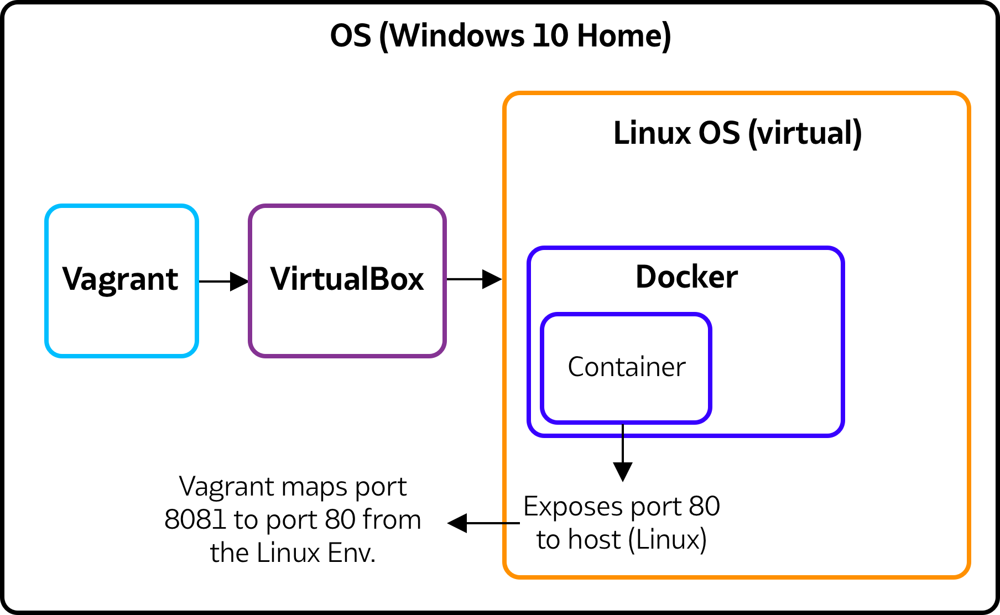
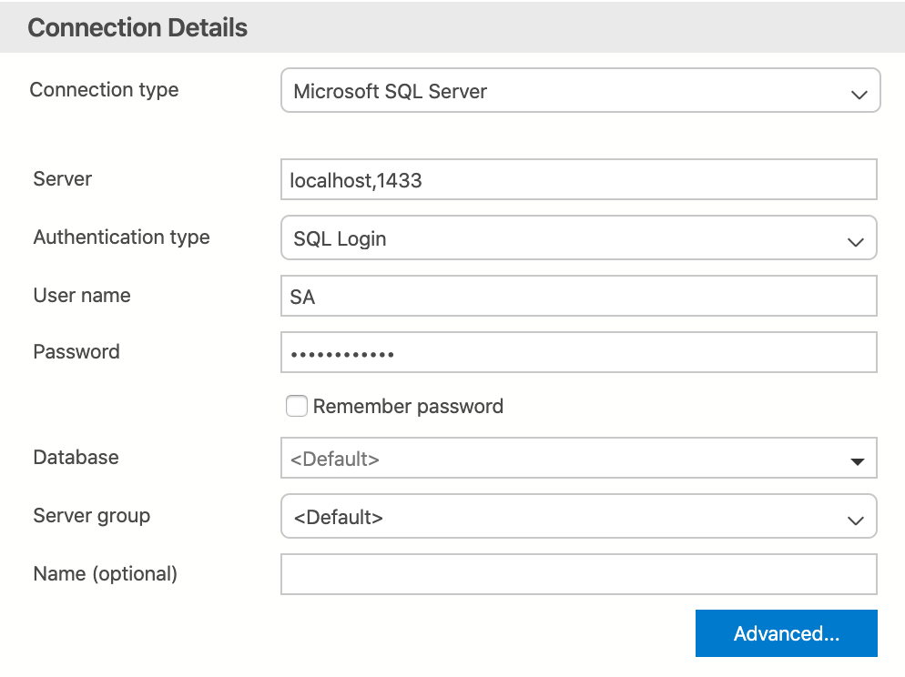
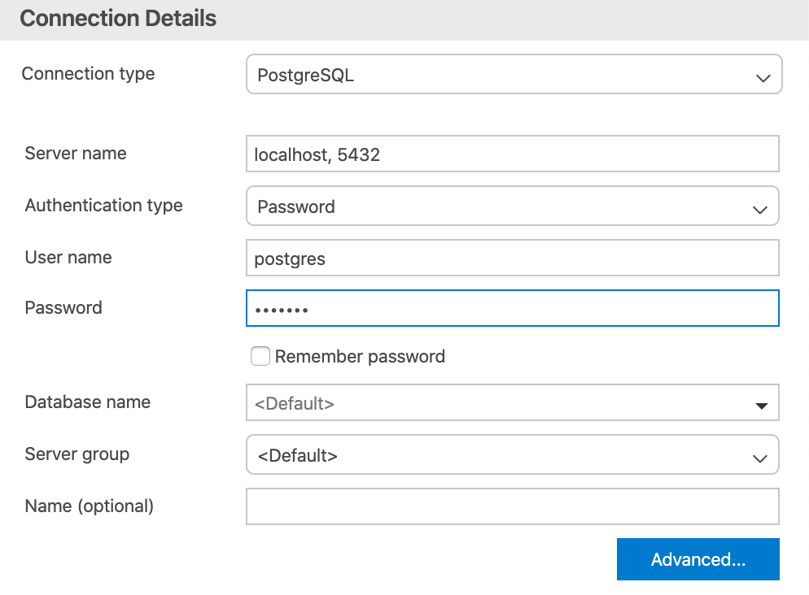

# Vagrant Docker DB Environment

This project has been created to provide a simple environment to give access to the Northwind SQL training database and a small IMDB dataase on Postgres for general SQL training. 

As per Docker specifications the Docker desktop edition does not run on Windows 10 Home which is a common edition for many learning on home desktops and laptops. The following instructions will allow you to install a virtual Linux environment with Docker already installed.

# Pre-requisites
Before progressing to install the virtual environment there are some dependencies your will need to download before running any scripts. These are:

* [Vargrant](https://www.vagrantup.com/) - Vagrant is a tool for building and managing virtual machine environments and helps lower environment setup time.
* [VirtualBox](https://www.virtualbox.org/wiki/Downloads) - Virtual box is the underlying software that will allow you to create virtual environments on your local laptop or desktop 
    * Ensure your download the 64 bit unless you know explicitly you're using an older 32 bit OS
* [git](https://git-scm.com/downloads) - You will need git installed for various project cloning and general source code management

## Overview of setup
We are aiming to create a virtual Linux environment on a Windows 10 Home host OS. The below Image is a visual representation of what is taking place:   

We are using Vagrant (specifically the Vagranfile) to create a Linux environment by using VirtualBox to handle the creation of the Virtual Machine (VM). The Vagrantfile in this project will also provision (install) Docker, git and expose the necessary ports to ensure we can access information and connections from our 'guest' VM (Linux) on our host (Windows).

We need to ensure that we are correct mapping our ports from Docker to Linux ad the to windows. In the example above we are showing how we would share port 80 between Docker and out linux container but then share port 80 on our linux container to port 8081 on our windows host:

Docker 80 : Linux 80 : Windows 8081

So, to access a web server on our docker machine we would type into our browser on Windows `localhost:8081`. This would then propagate from Windows port 8081 which is mapped (mirrored) to our linux environment 80 which in turn is mapped to our Docker container which has expose port 80.
  
# Setting up your Linux environment

Once you have cloned this project open your command line or Powershell terminal (or terminal if on Mac) and head to the folder `Vagrant_Docker_DB_Environment` and in the root of this folder should be the `VagrantFile`.

Now you are in the root project folder type `vagrant up` - You will see your environment build begin. Once the build has completed you can log into the environment using the command `vagrant ssh`. You will see a new terminal which will relate to your virtual linux environment!

# Connecting to the databases 

There are many SQL clients that can be used, it would be best to look up how to connect to databases on a local host using the details below.

This VM contains and exposes two separate databases and you will:

* MS-SQL server with the Northwind database
    * sever will be `localhost` and port `1433`
    * Username: `SA`
    * Password `Passw0rd2018`
* Postgresql server with 5000+ IMDB titles and data
    * sever will be `localhost` and port `5432`
    * Username: `postgres`
    * Password `postgres`

## Examples using Azure Data Studio
Azure Data Studio is a versatile simple tool to connect to both of the DB's stated above it can be downloaded from [here](https://docs.microsoft.com/en-us/sql/azure-data-studio/download-azure-data-studio?view=sql-server-ver15).  

The two images below show how to connect once your environment is set-up:

### MS SQL Example

### Postgesql Example

# Some useful tips

* to exit our vagrant Linux environment simply type `exit` and hit enter
* if you wish to stop/remove the images - from the root folder of this project use:
    * `vagrant halt` - stops your environment in the background - this may be useful once finished using this environment to prevent your system from becoming slow.
    * `vagrant destroy` - this will completely remove your environment giving you the option to completely delete backup folder/files as well.